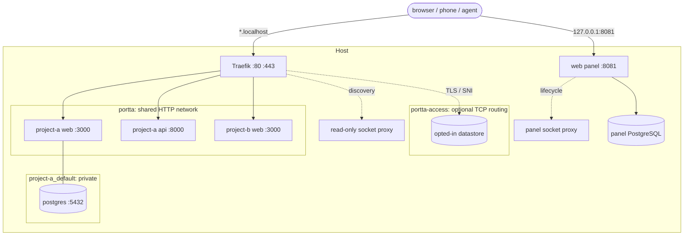

# Portta

A personal, experimental development environment for many Docker projects at once. Each one gets a predictable URL instead of a port to remember, on a laptop, a VPS or a homelab, and you can reach it from anywhere.

```text
$ portta urls
PROJECT                      SERVICE        URL
base-empresarial             api            http://base-empresarial-api.localhost
base-empresarial             web            http://base-empresarial-web.localhost
base-empresarial-issue59     api            http://base-empresarial-issue59-api.localhost
base-empresarial-issue59     web            http://base-empresarial-issue59-web.localhost
issue-flow                   web            http://issue-flow-web.localhost
```

All of those can use the same internal ports. None needs to publish one on the host.

## Why

I keep several side projects, experiments and prototypes alive at once. An idea may be written down today and picked up whenever there is time.

The work is not always on one machine. There is a laptop, a development VPS, a homelab, and increasingly agents such as Claude Code and Codex doing work while I am elsewhere. I still want to open a browser or a phone and see what is running, whether it is healthy, and what the last change actually did.

Everything runs in containers on purpose. Dependencies stay isolated, the host stays clean, and a stack can be started or discarded without becoming part of the machine.

That creates a different set of problems: port conflicts, ports nobody remembers, reaching a machine that has no public address, testing on a phone, and occasionally showing one URL to someone else. Portta is the arrangement I use to solve those for my own workflow. It is public because there is no reason for it not to be.

## What it does

**Names instead of ports.** A host port can only be held by one process, but many containers can listen on the same internal port. Portta therefore publishes almost nothing. One Traefik instance holds 80 and 443, HTTP services join one shared Docker network, and each gets a hostname derived from its Compose project and service names. Databases and caches stay on each project's private network, reached through a temporary loopback bridge or optional TLS/SNI routing when a human needs them.

**Reachable from where you are.** The base domain is a mode rather than a fixed value: `*.localhost` on a workstation, a name derived from the machine's address through sslip.io when there is no domain, or a wildcard you own. Beyond that, a host can be reached over Tailscale, or through a Cloudflare Tunnel that needs no open port and works behind CGNAT. A single service can also be shared on a temporary hostname with a mandatory expiry.

**The work around the code.** Branches and worktrees become parallel environments with their own namespaces and URLs. Existing Compose projects are adopted with a small overlay rather than moved. The optional panel opens the project: its tasks and board, the repositories with their commits and instruction files, the environments with one table of services and every way to reach them, the logs, who is working on what, and what the host has room for. Humans and agents share it through the same API, the CLI and `portta mcp`; GitHub issues bind to tasks and write back.

**This is for development, not deployment.** It exists so you can see and test what you are building, from wherever you happen to be. It is not a hosting platform, has no release or rollback story, and should not be what stands between your users and your application.

It is host infrastructure installed once, not a parent Compose project. It does not move projects, own their volumes, or participate in their lifecycle. See [ADR 0001](docs/adr/0001-decoupled-infrastructure.md).

## Screenshots

<table>
  <tr>
    <td width="50%"><a href="docs/images/panel-overview.png"></a><br><sub><b>Overview</b> — what is being worked on, and whether the host has room</sub></td>
    <td width="50%"><a href="docs/images/panel-projects.png"></a><br><sub><b>Projects</b> — the product, not the Compose stack</sub></td>
  </tr>
  <tr>
    <td width="50%"><a href="docs/images/panel-tasks.png"></a><br><sub><b>Tasks</b> — the local board for Demo Shop</sub></td>
    <td width="50%"><a href="docs/images/panel-environments.png"></a><br><sub><b>Environments</b> — one Compose stack per namespace</sub></td>
  </tr>
  <tr>
    <td width="50%"><a href="docs/images/panel-services.png"></a><br><sub><b>Services</b> — every routed and private service</sub></td>
    <td width="50%"><a href="docs/images/panel-overview-dark.png"></a><br><sub><b>Dark theme</b> — the same live overview</sub></td>
  </tr>
</table>

The panel is optional and loopback-only by default, where it answers as the local operator: reaching it there already means having the machine. Run `portta web up`, then open <http://127.0.0.1:8081>. Publishing it anywhere else makes it sign people in — accounts, roles, sessions, tokens ([authentication](docs/authentication.md)). The complete walkthrough and every screenshot are in [the panel documentation](docs/web-ui.md).

## How it works

This is the `local` profile with the optional panel enabled:



Traefik reaches HTTP services only on the shared network. It has no route into a project's private network.

There are three ways in beyond the local one, and each is a deliberate choice rather than a default. `remote-private` attaches the gateway to a Tailscale sidecar, `remote-public` binds the public interface, and the [Cloudflare Tunnel](docs/cloudflare-tunnel.md) connector dials out instead, which is the only option when the machine has no public address at all. The exact networks, profiles and persistence boundary are in [Architecture](docs/architecture.md).

## Requirements

**Required on the host:** Docker Engine 24+ with Compose v2 and a POSIX shell. Node is not required for the core commands ([ADR 0015](docs/adr/0015-node-on-the-host.md): `bootstrap`, `up`, `down`, `restart`, `status`, `logs`, `urls`, `inspect`, `update`, `doctor`, `version`, `toolbox`). The full CLI needs Node 22.12+. Git is needed only to develop Portta or to collect project metadata.

**Run by the gateway:** Traefik, filtered Docker socket proxies, `jq`, `socat`, OpenSSL, database clients, access bridges, and the panel's Node runtime.

**Only for developing Portta:** Node 22+, ShellCheck, and Playwright's browser dependencies.

| Verified environment | Evidence |
|---|---|
| macOS 15+ arm64 with OrbStack | Full suite run during development |
| Ubuntu 24.04 amd64 with Docker Engine | Full suite in CI |
| Ubuntu VPS with Docker and Tailscale | Installed from scratch, `doctor` clean |

Other platforms may work but are not claimed as verified. See the complete [compatibility matrix](docs/compatibility.md).

## Quick start

On a VPS or a workstation, one command installs it and the same command updates
it. It pulls published images, keeps everything under one directory, and asks
only what it cannot detect:

```bash
curl -fsSL https://raw.githubusercontent.com/fabioassuncao/portta/main/install.sh | bash
```

No clone, no build, and no Node on the host. It asks where to keep its data and
how you want to reach the panel (this server's address, over Tailscale, or
localhost only), and nothing else. Anything but localhost makes the panel sign
people in; it prints the address where the first account is created. Applications
stay unexposed either way. See [installing and updating](docs/install.md).

To work on Portta itself, take the checkout instead:

```bash
git clone git@github.com:fabioassuncao/portta.git
cd portta
cp .env.example .env

./bin/portta bootstrap
./bin/portta up local
./bin/portta doctor
```

Then start the bundled demo stacks and register them in the panel:

```bash
just up --demo
```

Among their routes are `demo-a-web.localhost`, `demo-a-api.localhost`, `demo-b-web.localhost`, and `demo-b-api.localhost`. Add `./bin` to `PATH` to drop the prefix.

## Adopting a project

The project stays in its own repository. Add an overlay that joins only its HTTP service to the shared network and opts it into Traefik:

```yaml
services:
  web:
    networks: [default, portta]
    labels:
      - "traefik.enable=true"
      - "traefik.docker.network=portta"
      - "traefik.http.services.${COMPOSE_PROJECT_NAME}-web.loadbalancer.server.port=3000"
networks:
  portta: { external: true, name: portta }
```

`portta analyze /path/to/project` reports the required changes without writing; `portta init /path/to/project` can generate the overlay. Follow the [adoption checklist](docs/adopting-projects.md).

## Documentation

The categorised documentation index, command reference, ADRs and project templates live in **[docs/README.md](docs/README.md)**.

## Security

Nothing is exposed by default. Datastores stay private, Docker access is filtered, public and VPN modes require explicit configuration, and destructive operations are constrained by ownership. Read the [threat model and hardening details](docs/security.md).

## Status

Experimental (`v0.x`), personal, and without a support promise. Expect rough edges and bugs. I break it regularly.

**Exercised end to end:** the local profile, the panel and its accounts, persistence, parallel environments, TCP access, and installing from scratch on a real VPS.

**Partly verified:** Cloudflare Tunnel. The transport was measured against a live tunnel from the public internet, including the single wildcard rule, the Host header surviving to the container, WebSocket, and each distinct failure mode. The named-tunnel path against a real zone has not been exercised, because that needs credentials I do not want in a test.

**Present but not finished:** the tunnel is configured through the CLI and the API, and has no panel interface yet. The capabilities and endpoints model exists in the shared core and is not exposed in the interface either. Remote profiles render and are checked for unsafe binds, but the tailnet and ACME paths need real credentials and are not automated.

Cross-host synchronisation and task orchestration are future work, not current features. The TypeScript package and its binary are both named `portta`. More mature tools exist. Use one of them if this particular set of trade-offs is not useful to you. Issues, pull requests and forks are welcome.

See [compatibility](docs/compatibility.md) and the [changelog](CHANGELOG.md).

## License

MIT. See [LICENSE](LICENSE).
