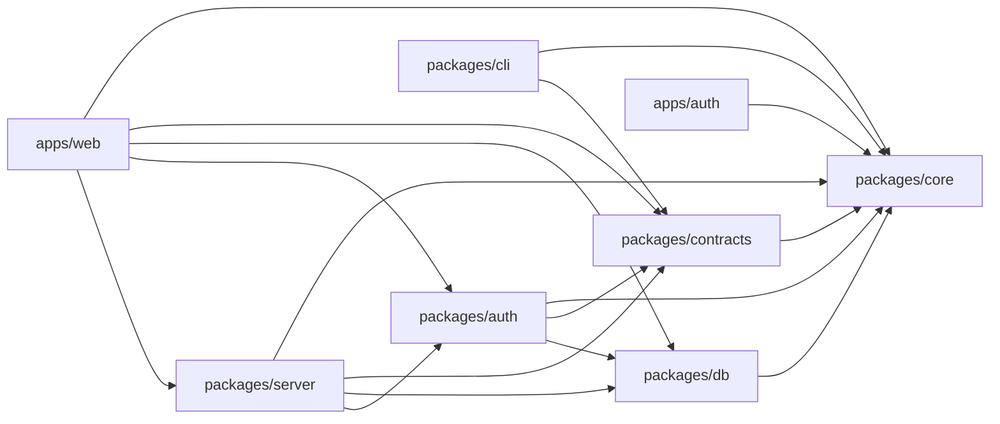

# Monorepo layout

Where new code goes, and how a command is added. The decisions behind this
page are [ADR 0014](adr/0014-monorepo-and-the-typescript-cli.md) and
[ADR 0015](adr/0015-node-on-the-host.md).

The panel lives at `apps/web`, and it composes rather than implements: the
services and the HTTP API are `packages/server`, the shapes they answer with
are `packages/contracts`, and the derivations the host and the CLI share are
`packages/core`. The TypeScript CLI lives in `packages/cli` and is configured
for unscoped publication as `portta`. `npm ci` at the repository root installs
every workspace from one lockfile.

One thing about that lockfile is worth knowing before it costs an afternoon.
Native bindings are optional dependencies chosen by platform, and npm records
`cpu` and `os` for them but not always `libc` — so inside the Alpine image it
can pick the glibc build of a package where the musl one was needed, and the
image build fails on a missing `.node` a long way from anything you changed.
Where the choice matters and can be avoided, it is: the login page's CSS is
minified by esbuild rather than by lightningcss for exactly this reason.

## Map

```text
portta/
├── apps/web/                the panel: Next.js pages and the process that serves them
│   ├── app/                 routes; (panel)/ carries the shell, docs/ the documentation
│   ├── components/          ui/ primitives, shell/, entities/, tasks/, settings/
│   ├── lib/                 api client, queries, live, i18n, docs collector
│   ├── messages/            en/*.json, pt-BR/*.json
│   └── server/              main.ts (the process), compose.ts (the dispatcher)
├── apps/auth/               the ForwardAuth service for project hostnames and shares
├── packages/core/           portta-core — shared derivations (private)
├── packages/contracts/      portta-contracts — API schemas, types, openapi.json
├── packages/db/             portta-db — Drizzle schema, migrations, client
├── packages/auth/           portta-auth-core — who is asking, and what they may do
├── packages/server/         portta-server — services, Hono API, background work
├── packages/cli/            portta — TypeScript CLI
├── bin/portta          Bash entry point; delegates when Node is present
├── scripts/                 Bash commands; shrinks as they migrate
├── docker/
│   ├── compose/              gateway Compose base and overlays
│   ├── images/               operational image contexts (apply, toolbox)
│   └── examples/             self-contained demonstration stacks
├── config/, docs/, tests/, templates/
└── package.json             workspaces: ["apps/*", "packages/*"]
```

| Workspace | Name | Published | Holds |
|---|---|---|---|
| `apps/web` | `portta-web` | no | The pages, the process that serves them, the Dockerfile, and the panel's own tests. No business rule |
| `apps/auth` | `portta-auth` | no | ForwardAuth for project hostnames and shares |
| `packages/core` | `portta-core` | no | Pure derivations: `env`, `config`, `discovery`, `capabilities`, `endpoints`, `inventory`, `apply`, `tunnel`, `password`, `metrics`. No process execution, ever |
| `packages/contracts` | `portta-contracts` | no (the future SDK's source) | The API's Zod schemas and types, and the generated `openapi.json` |
| `packages/db` | `portta-db` | no | The schema, the generated migrations and the client. No business rule |
| `packages/auth` | `portta-auth-core` | no | Better Auth, the security mode, the `Principal`, and the one `authorize` |
| `packages/server` | `portta-server` | no | Every business rule: services, the Hono API, Docker, Traefik, Git, GitHub, persistence, background work |
| `packages/cli` | `portta` | ready, not published by repository changes | Commands, formatting, provisioning, and every effect: `process`, `docker`, `host`, `detect`, `metrics` |

`bin/` and `scripts/` stay at the root. They are not a workspace.

## The one rule

> **Local facts come from Core, executed locally. Persistent decisions come
> from the API. Nothing is implemented twice.**

The CLI never opens PostgreSQL. The panel is the only writer of durable
decisions ([ADR 0013](adr/0013-what-the-panel-persists.md)). Docker inventory,
URLs, `.env`, `doctor`, Git collection, host metrics, `bootstrap` / `up` /
`down` run locally through core.

## Who may import whom

An arrow means "may import". Anything else is a defect, and
`tests/unit/boundaries.test.sh` fails on it in milliseconds.



Read the edges as consequences, not preferences:

- **`packages/core` imports nothing from the monorepo.** It runs on the host,
  in the panel and in the CLI; a dependency would make one of the three
  unbuildable. It has a second entry point, `portta-core/browser`, holding the
  modules with no `node:*` in them so a bundle can use them; `slug` is the
  reason it exists.
- **`packages/contracts` knows only core.** It is what the browser, the CLI and
  a future SDK compile against, so it cannot know a database exists. Its
  OpenAPI generator is a script, not source: it reaches for the server's routes,
  and nothing a consumer loads follows it.
- **`packages/db` holds the shape of the rows and nothing else.** It has no
  business rule to ask `auth` or the services about, which is what lets a suite
  run the real migrations against PGlite without starting a panel. Its enums are
  built from the constants in `core`, so a vocabulary exists once.
- **`packages/auth` answers one question and answers it once.** Who is asking,
  and what they may do. It owns Better Auth, the four roles, the permission
  vocabulary and `authorize`; the API, a Server Component and the event stream
  all read the same `Principal` from it. A second implementation of that
  decision is a second answer, and one of them will be wrong. It knows the
  database because the users are rows, and nothing else in it opens a socket.
- **`packages/server` is the only place with a business rule**, and the only
  one that opens Docker, Traefik, Git, GitHub or PostgreSQL. It exports names,
  never `export *` from a service, so `apps/web` cannot reach past what it
  means to offer.
- **`apps/web` composes.** A page calls a service through `lib/server/deps.ts`;
  it never fetches its own API from the server side, because the request would
  leave the process and come back through the same dispatcher to reach code the
  render already has.
- **`packages/cli` never imports the server or the database.** It talks to the
  panel over HTTP, which is the rule that keeps "the CLI never opens
  PostgreSQL" true by construction rather than by care.

## Where new code goes

| You are adding… | It belongs in… |
|---|---|
| A panel page | `apps/web` `app/`, as a Server Component; a Client Component only where there is interaction |
| A React component | `apps/web` `components/` |
| An API route, or the rule behind one | `packages/server` — `src/api/routes/` for the route, `src/services/` for the rule. Never in `apps/web` |
| A Zod schema the API answers with, or a type the CLI compiles against | `packages/contracts` |
| A table, a column, an index or a check | `packages/db` `src/schema/`, then `npm run db:generate --workspace=portta-db`. Never SQL by hand |
| A shared enum or vocabulary both the schema and the CLI need | `packages/core`, named once, with `packages/contracts` deriving its schema from it |
| Parsing `.env`, inventory, Traefik files, the Docker allowlist | `packages/core`, the first time a second consumer needs it |
| A CLI command | `packages/cli` `src/commands/`, colocated `*.test.ts` |
| Host diagnostics, Compose, filesystem provisioning | `packages/cli` calling `packages/core` |
| A host probe: an address, a tool's location, a file mode | `packages/cli` `src/host.ts`, with the verdict it feeds in `packages/core` |
| Host and project resource metrics | Types and normalizers in `packages/core` `metrics.ts`; collection in `packages/cli` `src/metrics/`. The panel only reads the files. See [Host metrics](host-metrics.md) |
| Anything else you were about to write in Bash | `packages/cli`. See [shell scripts](scripts.md): being the interface to `openssl`, `ssh` or `docker run` is not a reason |
| Persistent settings, project overrides, integrations | The panel API, never a second database client |
| A document | `docs/`, linked from [docs/README.md](README.md) |

Do not put panel-only code in `packages/core` "for later". A module enters
core when a second consumer exists, not in anticipation.

## How to add a command

1. Decide the path with the rule above. If the command needs a fact from
   Docker, Git or the host, it runs locally. If it needs a preference stored
   by the panel, it calls the API.
2. If the behaviour already exists in Bash, read the inventory in
   [ADR 0014](adr/0014-monorepo-and-the-typescript-cli.md). Port or keep; do
   not wrap.
3. If the behaviour already exists in the panel, extract the shared function
   into `packages/core` in the same change that the CLI starts calling it.
4. Put the command module at `packages/cli/src/commands/<name>.ts` with a
   colocated test. Headless-first: plain output, colour only when `stdout` is
   a TTY, `--json` for agents.
5. Delete the Bash counterpart in the same change, unless it is one of the
   zero-Node commands in [ADR 0015](adr/0015-node-on-the-host.md)
   (`bootstrap`, `up`, `down`, `status`, `doctor`). Those keep a Bash
   fallback.
6. `node dist/cli.js --help` must still start. A load-time defect is invisible
   to unit tests that never import the entry point.

## Node on the host

The host does not need Node for `bootstrap`, `up`, `down`, `status` and
`doctor`. The full TypeScript CLI needs Node 22.12+. The unscoped npm package
and the binary are both named `portta`.
Details in [ADR 0015](adr/0015-node-on-the-host.md).

## AGENTS.md

The root `AGENTS.md` is an index. It holds no rules of its own. Per-directory
`AGENTS.md` files are added only when a workspace has rules that are not true
of the rest of the repository, starting with `packages/cli` and
`packages/core` when they gain code. Document once; reference everywhere it
is needed. The operating rules for agents on a shared host already live in
[agent-guidelines.md](agent-guidelines.md).
