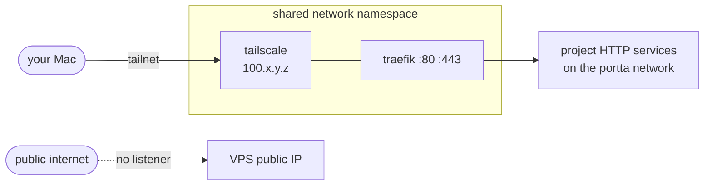

# Tailscale

Open the gateway's [Project access settings](http://127.0.0.1:8081/settings/general/project-access) to edit
the managed Tailscale keys from the panel.

Tailscale is how the gateway becomes reachable without becoming public. The
VPS keeps 80 and 443 closed to the internet, and the gateway answers on the
node's tailnet address.

## How it is wired

`docker/compose/attach/tailscale.yaml` runs one Tailscale container and puts Traefik
**inside its network namespace**:

```yaml
services:
  tailscale:
    image: tailscale/tailscale:v1.102.3
    networks: [gateway, control]
    # ...

  traefik:
    network_mode: service:tailscale
```

Sharing a namespace means Traefik listens directly on the tailnet interface.
Nothing is published on the host's public interface, so there is no firewall
rule to get wrong. Traefik keeps its access to the shared and control networks
because the Tailscale container joins them and the two share a namespace.



See [ADR 0007](adr/0007-tailscale-sidecar.md).

## Settings that are not optional

**`TS_USERSPACE=false`.** Userspace mode has no real interface in the
namespace, so an inbound tailnet connection would never reach Traefik. Kernel
networking is what makes the pattern work, hence `/dev/net/tun` and
`NET_ADMIN`.

**`TS_ACCEPT_DNS=false`.** MagicDNS rewrites `/etc/resolv.conf`. Traefik shares
this namespace and must keep resolving container names through Docker's
resolver, or discovery breaks in a way that is genuinely confusing to debug.

**`TS_AUTH_ONCE=true`** with a persisted `TS_STATE_DIR`. Without it, every
restart re-runs `tailscale up` and burns a non-reusable key.

**`state/tailscale/` persisted.** It holds the node identity. Lose it and the
node re-registers with a new name and address, and your DNS records point at
nothing.

## Auth keys

Generate an **ephemeral, pre-authorized, tagged** key in the admin console:

```env
TS_AUTHKEY=tskey-auth-...
TS_EXTRA_ARGS=--advertise-tags=tag:portta
```

Ephemeral so a leaked key ages out. Tagged so ACLs can name the node without
depending on a person's identity. Pre-authorized so the container does not sit
waiting for manual approval.

The key is only needed for the first login; after that the persisted state is
enough. It never enters Git: `.env` is ignored and lint fails on a tracked
`tskey-`.

## ACLs

Deny by default, then grant deliberately. A minimal policy:

```jsonc
{
  "tagOwners": {
    "tag:portta": ["autogroup:admin"]
  },
  "acls": [
    {
      // developers reach the gateway's HTTP ports, and nothing else
      "action": "accept",
      "src":    ["group:developers"],
      "dst":    ["tag:portta:80,443"]
    }
  ]
}
```

Note what is absent: no `*` in `src` or `dst`, and no database ports. Database
access has its own path, a bridge or a tunnel, rather than a standing ACL.

The gateway never edits your tailnet policy. This is a snippet to adapt.

## Container or host-native?

The container is the default: it is self-contained, versioned with the rest of
the stack, and leaves no daemon on the host.

Install Tailscale **on the host** instead when you need something outside the
namespace: subnet routing to the VPS's other networks, Tailscale SSH to the
host itself, exit-node behaviour, or a firewall integration. Then:

```env
TAILSCALE_ENABLED=false
PORTTA_BIND_ADDRESS=100.x.y.z    # the host's tailnet address
```

The gateway attaches to the host instead and binds only that address.
`remote-private` still refuses `0.0.0.0`.

## Checking it

```bash
./bin/portta network status     # tailnet address and every bind
./bin/portta doctor             # namespace sharing, auth, persisted state
docker exec portta-tailscale-1 tailscale status
```

`doctor` fails if Traefik is not actually in the Tailscale namespace, a case
where everything looks fine but nothing is reachable.

## Troubleshooting

**No tailnet address.** The key is expired, already used (with
`TS_AUTH_ONCE=true` and no persisted state), or the device needs approval.
Check `docker logs portta-tailscale-1`.

**Reachable on the tailnet but every route 404s.** Traefik is up but discovery
is broken, usually MagicDNS overwriting `resolv.conf`. Confirm
`TS_ACCEPT_DNS=false`.

**Works, then stops after a restart.** `state/tailscale/` is not persisted, so
the node re-registered under a new address.

**`/dev/net/tun` missing.** Some hosts do not expose it. Load the module, or
fall back to host-native Tailscale.
