# The web panel

The panel is where a development project is opened: what needs doing, who is
on it, which repositories make it up, what changed, which environments are
running, how to reach and test them, what the logs say and how much of the
host they use. It complements the CLI and `portta mcp` rather than replacing
them: all three work on the same API and the same model
([ADR 0032](adr/0032-portta-development-model.md)). Docker and Traefik remain
the live sources of runtime facts; the panel persists the decisions — Projects,
repositories, tasks, sessions — and a bounded history of what happened
([ADR 0013](adr/0013-what-the-panel-persists.md)).

It is off by default.

```bash
./bin/portta web up
./bin/portta web open      # http://127.0.0.1:8081
```

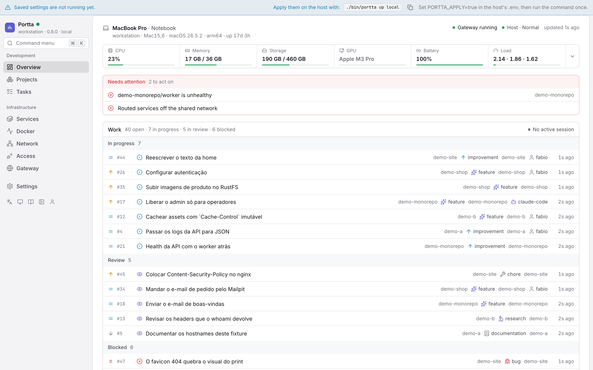

Every screenshot on this page comes from the same host, described in
`apps/web/e2e/demo-host.mjs`, seeded with `docker/examples`, and rendered by
the real panel at 1440×900. Regenerate them with `npm run screenshots` (see
[Development](#development-with-hot-reloading)).

---

## What it is for

The reference scenario is being away from the machine while an agent works on
a project on it. Open the panel: there is a task in progress, the agent that
took it, the repository it is in, the commits it produced, the branch and its
state, the environment running for it. Open the application through the
domain, the VPN or a protected address, test it, read the logs if something
is off, add a note or a subtask, and the agent reads the context again and
carries on. The same flow, with a person instead of an agent, is a normal day.

The second scenario is a host with several projects and several agents on it:
when it starts to run out of room, the Overview says which projects and
environments are using it, and one of them can be stopped from there.

It is not a Docker management tool. There is no image management, no volume
management, no `docker compose` editor, no terminal, no prune, and no way to
create an arbitrary container. See [Out of scope](#out-of-scope).

## Architecture

```text
Browser
   |                              http, loopback by default
Panel (Next.js + Hono, one process, one container)
   |-- filtered Docker API, internal control network
Panel socket proxy
   |                              read-only bind of the socket
Docker
Panel -- durable decisions --> PostgreSQL (private data network, no host port)
```

The panel application is a single container running a single Node process, and
that process is a dispatcher over four things:

```text
/api/*        the Hono API, including the event stream
upgrade /ws/* WebSocket, authorised before the handshake
/*            Next's handler: the pages, their data, their assets
```

`apps/web/server/main.ts` composes them and `apps/web/server/compose.ts` decides
which is which. One process because the panel is loopback by default with no
proxy in front of it, a session cookie needs a single origin, and one container
is what `portta web up` already starts.

A page is a Server Component: it calls `services.*` from `portta-server`
directly and never fetches the API this same process is serving. What it reads
is handed to the client as `initialData`, so the first paint is the page rather
than a spinner, and the event stream keeps it alive from there. A mutation
always goes through `/api` — the same contract the CLI and MCP use.

It joins two networks: the gateway's shared network (so it can be published, and routed by
Traefik when that is asked for) and its own `internal` control network, where
its socket proxy lives. A third, dedicated internal network connects only the
panel and its PostgreSQL database.

It never sees the Docker socket, has no Docker CLI, and reads exactly two
paths from the host: `.env`, which its Settings page edits, and `VERSION`.

Why a second socket proxy rather than Traefik's: Traefik's is read-only and
must stay that way, while the panel needs the container lifecycle. The two
permission sets are kept apart, and the panel enforces its own allowlist on top
of the proxy's. Its purpose-built client pins Docker Engine API `v1.43`, the
API implemented by the project's minimum supported Docker Engine 24, so a
newer daemon cannot silently change the response contract. See
[ADR 0008](adr/0008-web-panel-socket-proxy.md) and
[ADR 0017](adr/0017-no-docker-sdk.md).

### Technologies

| Layer | Choice |
|---|---|
| Pages | [Next.js 16](https://nextjs.org/) App Router, React 19, Server Components by default |
| Server | Node 24, TypeScript, a custom `http` server that dispatches to Next and Hono |
| API | [Hono](https://hono.dev/), Zod for input validation, OpenAPI generated from the routes |
| UI | Tailwind CSS 4, Radix primitives, TanStack Query, next-themes, i18next |
| Persistence | PostgreSQL 18, Drizzle ORM, generated migrations |
| Live updates | Server-sent events, fed by Docker's own event stream |
| Tests | Vitest (services, API, components, schema), Playwright (end to end) |

There is no Vite in the panel. The one Vite build left in the repository makes
the login page `apps/auth` serves, which is a separate service on a separate
origin and may not import from the panel.

### Where the code lives

```text
apps/web/
├── app/                 routes. (panel)/ has the shell; docs/ is the documentation
├── components/          ui/ primitives, shell/, entities/, tasks/, settings/
├── lib/                 api client, queries, live, i18n, docs collector, format
├── messages/            en/*.json, pt-BR/*.json
├── server/              main.ts (the process) and compose.ts (the dispatcher)
└── public/              the favicon, and nothing that needs a request elsewhere
```

### Shell and navigation

The sidebar has two groups. **Development** — Overview and Projects — is the
daily flow; **Infrastructure** — Services, Docker, Network, Access, Gateway —
is the technical perspective over the same host; Settings sits alone at the
end. Each section sets a contextual browser title ending in `Portta`; a
project, task, repository or environment route refines it with its name. The
title belongs to the route: every page exports `generateMetadata`, so tabs,
bookmarks and history never inherit the previous page's title. The built UI also serves its SVG favicon
locally, with no browser request to a third-party asset.

At `md` and above, the sidebar can collapse from its 224px labelled form to a
48px icon rail, with the `[` key or the control at its foot. The `portta-sidebar`
preference survives reloads when local storage is available and safely defaults
to expanded when it is not. Sections are links, so they open in a new tab like
any link; icons keep tooltips and accessible labels, and the active section
carries `aria-current="page"`. Below `md`, navigation remains the labelled
horizontal strip and the collapse control is hidden.

`⌘K` (`Ctrl+K` elsewhere) opens the command menu: every section, every project
and its tasks, the actions of the current page (a new task, folding the
sidebar) and the preferences (theme, language). Typing narrows it; Enter runs
the highlighted entry. The visual language of the whole panel is described in
[Design system](design-system.md).

PostgreSQL stores decisions and identity, not observations. Everything live on
screen (services, URLs, networks, ports, health and bridges) is still read from
Docker at request time, so a container that disappears simply stops appearing.
The database keeps the gateway instance, project identity, typed preferences
and integration configuration. If it is down, the panel and its Docker-backed
pages remain available and diagnostics report the degraded state. See
[Panel persistence](persistence.md).

---

## Starting it

```bash
./bin/portta web up          # build if needed, then start
./bin/portta web open        # print the URL, and open a browser
./bin/portta web status      # where it listens, and whether it is healthy
./bin/portta web logs        # follow it
./bin/portta web restart
./bin/portta web down        # stop it; the gateway keeps running
./bin/portta web disable     # stop it and take it out of `portta up`
./bin/portta db status       # database health
./bin/portta db migrate      # apply pending SQL without a restart
```

`web up` writes `PORTTA_WEB=true` to `.env`, so from then on
`portta up` brings the panel along with the rest of the gateway.
`web disable` undoes that.

The panel image still builds its own Node runtime. Starting it through the full
CLI requires Node 22.12+ on the host; the core zero-Node fallbacks remain
`bootstrap`, `up`, `down`, `status` and `doctor`.

### Development, with hot reloading

```bash
just dev                     # gateway up, panel with hot reloading, pending SQL
just db-migrate              # apply pending SQL without a restart
./bin/portta web dev         # the panel alone, on a gateway already running
```

One container, one port. The panel is a single process, so Next's HMR arrives on
the same `http://127.0.0.1:8081` the API answers on — there is no second server
and no second port to remember.

`apps/web/{app,components,lib,messages,server,public}`, `apps/auth/{src,ui}`,
`packages/*/src`,
`packages/db/drizzle` and the Markdown under `docs/` are bind-mounted, so the
image's `node_modules` stay in place. An edit to a page or a component reloads
in the browser; an edit to `server/main.ts` or the ForwardAuth backend restarts
its process, and its login UI rebuilds in watch mode. A newly
generated migration is visible to the next `portta db migrate` without
rebuilding the image.

The book icon and every `/docs/…` link stay on that same port: the documentation
is a route of the panel, not a second site.

`./bin/portta web up` goes back to the built image.

If you do have Node on the host and prefer to work outside containers:

```bash
npm ci                                          # from the repository root
npm run dev --workspace=portta-web              # the panel on :8081
npm test --workspace=portta-web
npm run test:e2e --workspace=portta-web
npm run openapi --workspace=portta-contracts    # refresh packages/contracts/openapi.json
```

`npm run build --workspace=portta-web` is `next build` followed by an esbuild
bundle of `server/main.ts` into `dist/server.mjs`. It needs the workspace
packages built first (`core → contracts → db → server`): under
`NODE_ENV=production` the `development` export condition no longer applies, so
each resolves to its `dist/`. The image does exactly that, in that order.

### API contract

The panel publishes an OpenAPI 3.1 contract at
`http://127.0.0.1:8081/api/openapi.json`. It is generated from the same route
registrations and Zod schemas the server and UI use: parameters, request
bodies, response shapes, status codes, read-only refusals and the SSE payload
are all part of the document. It declares the host-scoped Portta session and
the HTTP Basic compatibility path for non-browser clients. Traefik asks the
separate auth process to enforce either one before a request reaches the panel.

`http://127.0.0.1:8081/docs/api` renders that document: operations grouped by
tag, resolved schemas for parameters, request bodies and responses, the
declared security schemes, and a console. `/api/docs` redirects there, so a
bookmark keeps working.

The console executes a `GET` on a click. A `POST`, `PUT`, `PATCH` or `DELETE`
says what it is about to send and waits for a second, explicit confirmation,
because it is a real request against this panel. Read-only mode and the
same-origin write guard come back as the API's own error payload rather than as
a generic failure, so a refusal reads as a refusal.

It is enabled by default only while the panel stays on loopback. A routed panel
returns 404 unless `PORTTA_RUNTIME_API_DOCS=true` explicitly opts in. The JSON
contract stays available because a caller that reached the API can already
inspect it.

`packages/contracts/openapi.json` is checked in so an API change is visible in
review. `npm run openapi:check --workspace=portta-contracts` regenerates it in
memory and fails on byte-level drift. Adding or changing a route therefore
requires updating its attached description and running
`npm run openapi --workspace=portta-contracts`.

### The documentation, served from the panel

`http://127.0.0.1:8081/docs` is this documentation — every file under `docs/`
including the ADRs, plus the README and the changelog — rendered at build time
into static pages, with a sidebar, search and both themes. The book icon beside
the language and theme controls opens it.

They are ordinary routes of the panel (`app/docs/[[...slug]]`), prerendered by
`generateStaticParams`, so a deep link is a real URL a server can answer and a
browser can bookmark.

The source of truth does not move: `docs/*.md` stays ordinary Markdown, readable
on GitHub, with no front matter and no second copy. The navigation is the
section order of [`docs/README.md`](README.md), which the project already
maintains by hand.

Offline by construction. Everything comes from the image: no CDN, no font host,
no telemetry, and no Markdown parser in the panel's production tree — the
parsing happens at build time and only the rendered HTML ships. A link that
leaves the documentation set opens the file on GitHub and is marked with an
arrow. A Mermaid fence is ordinary Markdown on GitHub. In the site it becomes
a diagram: `mermaid` ships in the documentation bundle and renders in the
browser the image already serves, with no CDN and no Puppeteer at build time.
A fence that fails to parse stays as the source.

Because the build reads every link, it is also the link checker this repository
did not have: a link that names a documentation page which does not exist fails
`npm run build --workspace=portta-web`.

Two switches, independent on purpose:

| Key | Gates | Default |
|---|---|---|
| `PORTTA_RUNTIME_DOCS` | the guides at `/docs` | enabled, including when routed |
| `PORTTA_RUNTIME_API_DOCS` | `/docs/api` and its console | on for loopback, off when routed |

The guides are static text with no host information in them, so a routed panel
may serve them. The console issues real requests, so it keeps the conservative
default. Neither weakens authentication: when the panel is protected, the
ForwardAuth service runs before either path is reached
([ADR 0027](adr/0027-forward-authentication-service.md)).

### Regenerating the screenshots

The images on this page and in the README are produced by the real panel, run
against a fixed host described in `apps/web/e2e/demo-host.mjs`, a host metrics
snapshot the script writes itself (no collector runs), and a disposable
PostgreSQL that imports `docker/examples/*/portta.example.json`. Every frame is
1440×900 (`deviceScaleFactor` 2, so the files are 2880×1800):

```bash
npm run screenshots --workspace=portta-web
```

They are generated rather than taken by hand so they stay in step with the UI,
show the same thing every time, and never contain whatever happened to be
running on the machine that produced them. Change the host in `demo-host.mjs`
and the framing in `e2e/screenshots.mjs`.

---

## Reaching it

### Local

`http://127.0.0.1:8081`, and nothing else. The port is published on
`PORTTA_WEB_BIND_ADDRESS`, which is `127.0.0.1` and should stay that way.

Change the port if 8081 is taken:

```bash
./bin/portta web up --port 8099
```

### Over the VPN

On a VPS, the panel is useful precisely when you are not sitting at the VPS.
The private profile routes it through Traefik, which on that profile listens on
the tailnet and nowhere else:

```bash
./bin/portta config set panel.auth required
./bin/portta web up --expose vpn
# https://portta-web.vpn.example.com
```

This adds a Traefik router for `PORTTA_WEB_HOST.<domain>`. It is refused on the
`remote-public` profile, where that private router would be public, and it is
refused while `PORTTA_AUTH_MODE` is `disabled`: a routed panel can stop and
remove every container on the host, and it would answer anybody who found it.

A routed panel also defaults to read-only. `--writable` opts out, deliberately.

### Signing in

The panel signs people in itself. On a routed panel, `PORTTA_AUTH_MODE=required`
means the first visit lands on `/setup`, which creates the owner — the only
account that is ever created that way. Everybody after that is created by an
administrator, and each of them has a role that decides what they may do.

```bash
# from the host, when there is no browser on it
printf %s "$PASSWORD" | ./bin/portta auth bootstrap \
  --name 'Ada Lovelace' --email ada@example.com --password-stdin
```

The session is a cookie the panel issues and can revoke; banning somebody takes
effect on their next request. A CLI or a coding agent carries a `ptt_` token
instead, which never holds more than its owner's role. Nothing in front of the
panel decides any of this. See [Authentication](authentication.md) and
[ADR 0035](adr/0035-authentication-lives-in-the-panel.md).

### Public exposure

```bash
./bin/portta web up --expose public
# https://portta-web.dev.example.com
```

Public exposure uses the same Portta login, lockout and host-scoped sessions.
It remains an explicit choice because this panel controls container lifecycle;
prefer a VPN when the audience does not need a public path, and use TLS whenever
the route crosses an untrusted network.

If you are on a plain VPS without a VPN, an SSH tunnel is the answer:

```bash
ssh -N -L 8081:127.0.0.1:8081 deploy@vps
# then open http://127.0.0.1:8081 locally
```

### Read-only mode

```bash
./bin/portta web up --read-only
```

Every mutating endpoint answers `403`. Useful when an agent is driving the
panel and you want it to be able to look but not touch.

---

## What you see

### Overview

The Development Dashboard, in the order the questions come. The first is
whether this machine has room, so it is answered first, in the band at the
top; the rest follow:

- **Work** — the tasks in progress, in review and blocked across every
  project, with the person or agent on each;
- **Sessions** — who is working, on what, since when, with how many commits;
- **Needs attention** — unhealthy services, degraded environments, tasks whose
  local edit conflicts with GitHub, a host under pressure, and what the
  gateway's own diagnostics failed;
- **Projects** — each product at a glance: open and in-progress tasks, active
  sessions, running environments, health, last commit, last activity;
- **Code** — the most recent commits across every repository, and the
  repositories with uncommitted or unpushed work;
- **Using this host** — the environments using the most of it, each with a Stop.

The page has no visible title: its subject is the host, so the host is what
it opens with. One line says what the machine is — its commercial name where
the platform reports one (`MacBook Pro`) or else its hostname, and whether it
is a notebook, a desktop, a server or a virtual machine, from the chassis the
collector read; a machine that reports none of that gets its name and nothing
invented. The line under it holds the facts: the hostname when the commercial
name took its place, the provider or hypervisor of a virtual machine
(`Hetzner`, `QEMU`), the model, the OS and its version, the architecture, and
how long it has been up. Beside them sit the gateway's state, the host's
verdict — **Normal**, **Watch**, **Under pressure** or **Critical**, computed
from every reading together (see `hostPressure` in `packages/core`) — and the
age of the last snapshot. Then every measurement `portta host collect`
reported — CPU, memory, storage, and, where the machine has them, GPU,
temperature, battery and load — is one cell of a strip, with the last thirty
minutes and the details in its tooltip. A host that has no battery grows no
battery cell. The top says who the machine is; the strip says how it is. The
same pressure is said once at each level: the verdict names it, the reading's
colour points at it, and the attention band spells out the readings that
caused it.

The page sizes itself to what there is to say. With nobody working, the
sessions panel is a word in the work panel's corner rather than an empty
card; with nothing to act on, the attention band is one line; with no
commit collected yet, the code section is a heading and the command that
collects one.

The gateway's configuration lives on the Gateway page. Without PostgreSQL the
work and project sections are empty and say so; the runtime, the host and the
diagnostics still answer. It is served by `GET /api/overview`, which
`portta overview` and an agent read too.

### Projects

Every page below is a route, not a tab held in memory: `/projects`,
`/projects/<slug>`, `/projects/<slug>/tasks`, and so on. Each one is a link
somebody can paste, a bookmark that survives a reload, and a step the browser's
back button walks. What a role may not do is not shown rather than shown
disabled — the exception is a task's own controls, which stay visible and
inert, because a task's status is information a viewer came to read.

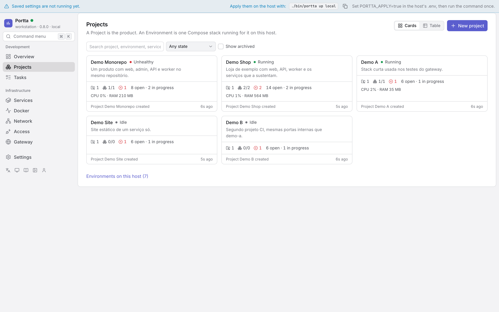

The products you recognise, as cards or as a table: repositories, open tasks,
who is working, running environments, health, last commit and last activity.
**New project** creates one; a Project needs the panel's database and the page
says so when it is down. `Environments on this host` opens the list of every
Compose project Docker is running, adopted or not.

Both views are places to act, not only to look. A card carries the one action
its state allows — start what is stopped, stop what is running — and a menu
with the rest: tasks, repositories, environments, settings, archive, delete.
An action that could not change anything is not offered.


The table sorts on any column, hides the ones a given host does not care about,
and selects rows for a bulk start, stop, restart or archive. The arrangement is
remembered per table. Nothing destructive happens without saying what it will
do: stopping a project names its environments and counts its containers,
and deleting one asks for its slug and states what survives.
The panel classifies a Project's location against Projects Home by comparing
paths the host scan reported; it never mounts Projects Home or any project
directory.

Opening a Project is the cockpit. The header carries its health, its tasks and
sessions, an **Open / Test** menu for its primary environment and **New task**;
below it, tabs that are URLs:

| Tab | What it holds |
|---|---|
| **Overview** | Development status (in progress, blocked, next, active sessions), the repositories with their git state, the environments with their services and an Open / Test each, the recent activity, and the resources the project uses |
| **Tasks** | The board and the list, below |
| **Repositories** | Each repository as a row; **Add repository** offers what the host scan discovered, what the GitHub App was granted, or a path typed by hand |
| **Environments** | The environments adopted, why each was adopted, and **Adopt** for one that was not |
| **Activity** | The timeline: tasks moved, notes, sessions, environments started and stopped, commits the scan noticed |
| **Settings** | Name, description, place under Projects Home, archive, and delete — which removes what only Portta holds and names it |

### Tasks


A task is Portta's own: it exists without GitHub. `/projects/<slug>/tasks` is
the board — six columns, `Backlog`, `To do`, `In progress`, `Review`,
`Blocked`, `Done` — or the list, nested by parent; the choice and the filters
(status, assignee, repository, text) live in the hash, so a filtered view is
a link somebody can paste. A card moves by dragging or from its menu; the
write happens at once and a refusal rolls it back visibly.

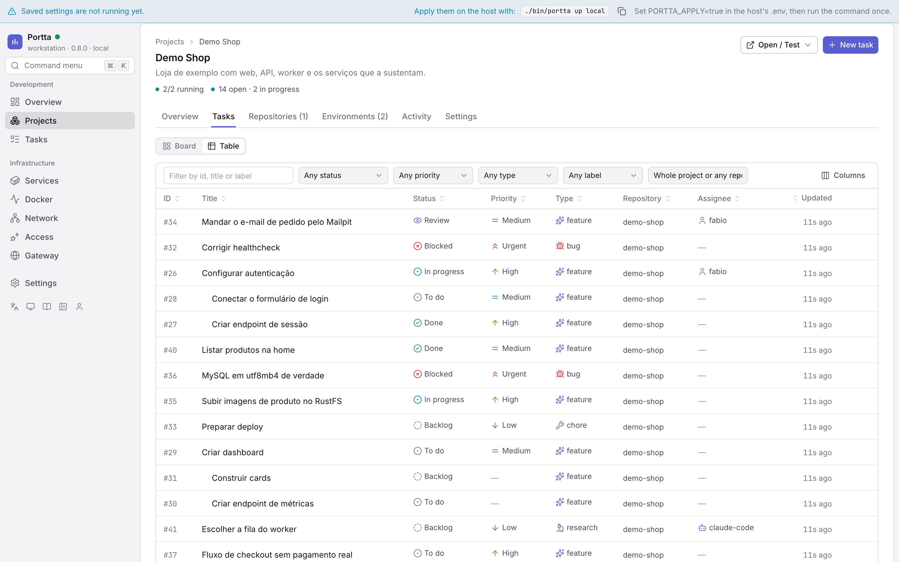

The **Table** view is the same rows as a table rather than as a board: sortable
by any column, with the columns a given host does not care about switched off,
and a status changed from the row without opening the task. Subtasks stay
nested under their parent until a column is sorted on.

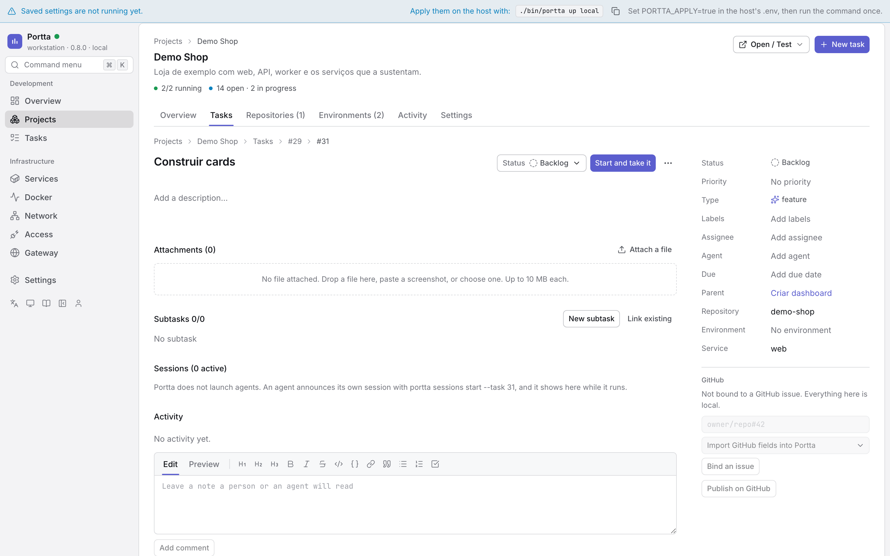

A task page, `/projects/<slug>/tasks/<id>`, carries the description, the
subtasks, the notes, the sessions working on it and their commits, the
environments it runs in (linked by the `portta.task` label, the branch name,
the namespace, or by hand) and the GitHub binding: which issue, whether the
last local edit reached GitHub (`synced`, `pending`, `conflict`), and the
actions — bind to an existing issue, publish as a new one, sync, settle a
conflict either way, unbind, comment on the issue. See
[github.md](github.md#issues-and-tasks).

`portta tasks` and the MCP tools read and write the same rows
([cli.md](cli.md), [mcp.md](mcp.md)).

### Repositories

`/projects/<slug>/repositories/<id>` is one repository: branch, HEAD, the
working tree spelled out, ahead/behind, the remote, the directory on the host,
and three tabs — the overview with open pull requests and the environments
running from it, the last twenty commits, and the **instruction files** the
host collected (`AGENTS.md`, `CLAUDE.md`, `.cursor/rules/*.mdc`, …) with their
content and whether they differ from HEAD.

None of it is live. `portta repos scan` collects it on the host and the
metrics watcher repeats it once a minute; every block says how old it is and
carries the command that refreshes it. See
[ADR 0010](adr/0010-git-collected-on-the-host.md) and the amendment in
[ADR 0032](adr/0032-portta-development-model.md).

### Environments

`/environments` lists them; `/environments/<name>` is one, with `logs` and
`settings` as routes beside it. The rail shows Docker, Network and Gateway only
to somebody who holds `docker:read` or `gateway:read` — a navigation entry that
would answer 404 is a worse answer than no entry. Starting, stopping and
restarting need `environment:operate`; rebuilding, removing and forgetting need
`environment:destroy`; the overrides form needs `environment:settings`. Reading
logs is `logs:read`, which a viewer has: they can watch what is happening and
change none of it.

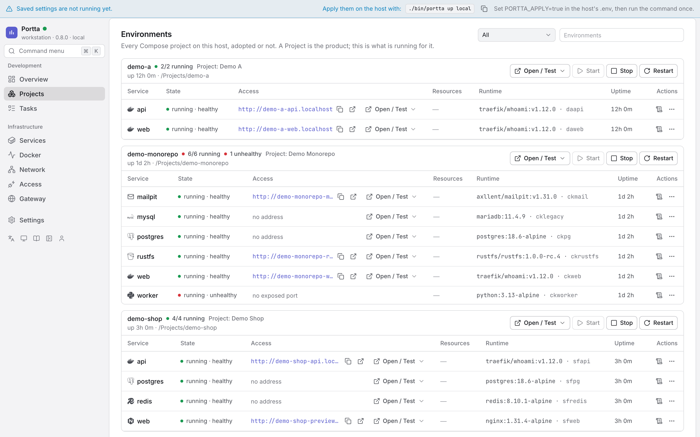

`/environments` lists every Compose project on this host, adopted or not,
each as a table of its services. `/environments/<name>` is one environment:


The header says how many services run, which Project adopted it and why,
which repository and branch it runs from, and the task it is working on when
the panel can tell; then **Open / Test**, Start, Stop, Restart, Rebuild and
the two named removals. Three tabs:

| Tab | What it holds |
|---|---|
| **Overview** | One row per service: state and health, the primary address with copy and open, **Open / Test**, CPU and memory from the host collector, image and container, uptime, and the actions that apply. A row opens a drawer with every endpoint, the connection details of a datastore, ports, networks, mounts, what Traefik says, the temporary share, the hostname alias, and the logs inline |
| **Logs** | Every service at once, interleaved, or one of them; see [Logs across an environment](#logs-across-an-environment) |
| **Settings** | Display name, description, primary service, collapsed services, pinned and archived, service notes and the hostname alias — nothing is written inside the project |

**Open / Test** is the one menu that answers "how do I reach this": every
address by scope — local, LAN, VPN, public — with open and copy, and for a
datastore the loopback bridge to open or close, the host, the port and a
connection string. It is the same model the Access page manages
([ADR 0024](adr/0024-capabilities-providers-endpoints.md)).

An old `/environments/<name>/services` opens the overview; `/…/git` opens
the repository the environment runs from.

#### Remembered environments

An environment whose containers were all removed does not vanish: the panel
remembers where it ran (`working_dir`, the Compose files) and lists it as
**remembered**, with no services. On a Project page it stays under its
Project. Two things can happen to it: **Start**, which asks the runner for
`docker compose up` with the remembered paths when `PORTTA_RUNNER=true`, or
answers with the exact command to run on the host when it is not; and
**Forget**, which drops the row with its overrides and links, and touches
nothing on the host. A live environment cannot be forgotten: stop and remove
it first. Removing an environment (with or without its volumes) leaves it
remembered, since its directory is still there; only removing the directory
forgets it in the same step. `GET /api/environments?all=true` returns both kinds, each with
`presence: live` or `presence: remembered`.

#### Logs across an environment

The Logs tab reads **every** service of the environment at once, interleaved by
the timestamp Docker already puts on each line, with the service name in front:

```text
web      | 10:00:01  listening on 3000
api      | 10:00:02  GET /health 200
postgres | 10:00:03  ready to accept connections
```

A selector narrows the view to one service, and the choice is in the URL
(`/environments/alpha/logs?service=api`), so a link opens on exactly what you were
reading. Tail size, the text filter, follow, timestamps and copy are the same
controls the service drawer has, because it is the same component; copying an
aggregated view prefixes each line with its service.

Services are read concurrently on the server, and a source that could not be
read is reported **beside** the ones that answered rather than replacing them: a
stopped container is marked with its state, an unreadable one carries the
reason, and four working services stay on screen. An unknown environment is a
404; a known one whose sources all failed is a 200 that says why.

The aggregated default is 100 lines per service (200 when reading one), clamped
to 2000 overall, so a ten-service environment cannot ask for twenty thousand
lines. If a container logs through a driver that omits timestamps, the view
says ordering between services is approximate rather than pretending otherwise.

**Out of scope, deliberately:** streaming over SSE or WebSocket, retention,
indexing, structured-log parsing, level filtering and download-as-file. This is
a bounded tail on a three-second poll, and it is meant to stay one.

#### Naming an environment without touching it

A cloned third-party repository arrives as `awesome-thing-svc-1` on
`awesome-thing-svc-1.localhost`, with five services listed flat. The
environment's **Settings** tab adjusts all of that from the panel, and writes
nothing inside the project — no file, no label, no dependency, no commit.
`git status` in the clone stays clean after using every control here.

| Override | Effect |
|---|---|
| Display name | The heading and the sort key. The derived name is still shown beside it |
| Description | A line under the heading |
| Primary service | The service the environment's Open / Test targets first |
| Collapsed services | Folded away by default, never removed |
| Pinned / archived | Ordering and default filtering in the list |
| Service note | A line on the service row |
| **Hostname alias** | **An additional hostname, routed by Traefik** |

Everything except the alias is presentation, kept in the gateway's own
database. **Nothing is ever only-renamed**: the derived name and the derived
hostname stay on screen next to the override, so a hostname that behaves oddly
can still be traced back to the label that produced it.

Overrides key on `COMPOSE_PROJECT_NAME`, so `storefront` and
`storefront-issue59` are two environments with two sets of overrides, and a new
worktree starts blank. That is deliberate: two worktrees must never contend for
one hostname.

With PostgreSQL stopped, every environment renders exactly as it does without
any persistence at all, and the override endpoints answer `503` with a hint.
The feature disappears; nothing else notices.

#### A hostname alias is a nickname, not a rename

```text
alpha-web.localhost      derived, still answering
shop.localhost           alias, answering too
```

Setting an alias writes one router into `portta-aliases.yaml`, the third
and last file the panel may write in Traefik's dynamic directory
([ADR 0011](adr/0011-panel-reads-traefik-writes-one-file.md)). Traefik
hot-reloads it: no container is recreated and the gateway is not restarted.

**Both hostnames answer.** The panel cannot rewrite a label on a running
container, and would not restart someone's environment to change a nickname, so
an alias can only ever be additional. The UI shows both, everywhere.

Aliasing **refuses** rather than warns, and every refusal happens before
anything is written:

- a hostname a running container already derives or declares;
- a hostname another alias already took;
- a hostname outside `PORTTA_DOMAIN`, `PRIVATE_DOMAIN` or `PUBLIC_DOMAIN`
  — the gateway will not mint an address it cannot serve;
- a service whose `kind` is not `http`: a database is reached through
  [tcp-routing.md](tcp-routing.md), not by an HTTP router;
- a service off the shared network, or one that never enabled Traefik;
- a service with no unambiguous HTTP port. The project's own
  `traefik.http.services.*.loadbalancer.server.port` label is used when present
  and a single exposed port otherwise; anything else is refused rather than
  guessed, because a guessed port produces a router that silently 502s.

The database row and the generated file are written as one operation, and a
failed file write rolls the row back, so the panel and Traefik cannot disagree
about what answers.

The CLI reads the same file, so the two tools never contradict each other:

```bash
portta urls          # aliases are listed and marked as such
portta doctor        # flags an alias whose target container is gone
```

Anything the panel refuses can still be written by hand into
`config/traefik/dynamic/` — that file is yours, and the panel never touches it.

#### Sharing it, temporarily

The Exposure section on a service offers three states: **private** (the absence
of a share, and the default), **protected** (an additional hostname behind a
generated password) and **public** (an additional hostname with none, refused
unless public access is already on).

Every share carries an expiry, the password is shown exactly once and stored
only as a hash, and revoking one deletes a block from a generated file. The
project's own router, labels and configuration are never touched.
`portta share list|revoke|gc` manages the same objects from the host. See
[sharing.md](sharing.md).

#### Why a route behaves like this

Opening a service shows what Traefik itself says about it, next to what its
labels say: the router it built, the rule, the entrypoints, the middlewares, the
backend it resolved, and its status with Traefik's own error text when it
refused one.

```text
Traefik   storefront-web@docker   enabled   websecure     dashboard →
          Host(`storefront-web.dev.example.com`)
          middlewares: portta-secure-headers@file
          → http://172.18.0.7:3000
```

This is the one question labels cannot answer. The panel derives hostnames the
same way Traefik does and is right about them, which is exactly why "the labels
look right and it still 404s" had nowhere to go.

It needs the Traefik API, which means `PORTTA_DASHBOARD=true`, and that is
off by default. When it is off the panel says **the API was not asked** rather
than implying the labels were confirmed, and everything else is unchanged.
`doctor` gains two checks when it is on: a routed service Traefik never built a
router for, and a router Traefik refused, quoted.

The read has its own timeout and its own cache and never runs while a page is
rendering, so a slow or dead Traefik costs nothing but this block. The dashboard
is linked to, never embedded: it is a good tool and duplicating it would need
the insecure-mode API exposed more widely than it already is. See
[ADR 0011](adr/0011-panel-reads-traefik-writes-one-file.md), and
[security.md](security.md) for what enabling that API costs.

### Services

Every service of every integrated project as a flat, filterable list: image,
type, status, health, container port, and the addresses it answers on, split
into **Local**, **VPN** and **Public**. Every address has a copy button.

Addresses come from the same Docker labels Traefik routes on, so what the panel
prints is what Traefik serves. An explicit ``Host(`...`)`` label wins over the
derived hostname, exactly as it does inside Traefik.

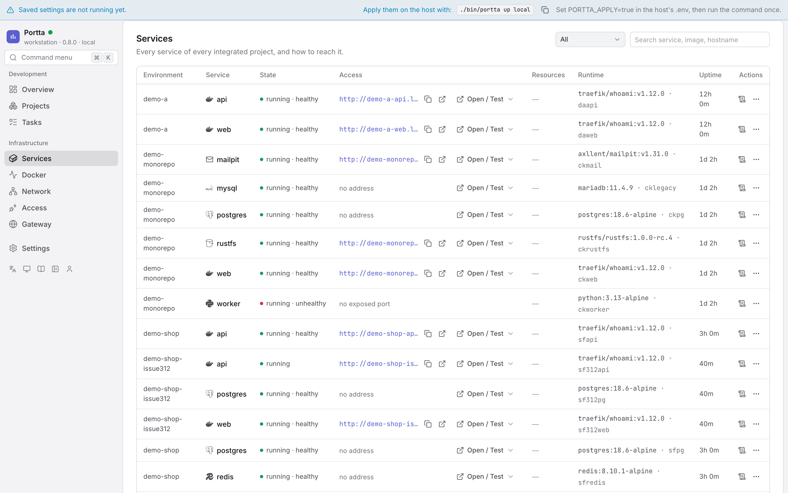

### Docker

Every container on the host, in four clearly separated sections:

| Section | What it means |
|---|---|
| **Portta** | The gateway's own infrastructure. Managed by the CLI, not from here |
| **Integrated projects** | Compose projects connected to the gateway |
| **External Docker** | Compose projects the gateway does not manage |
| **Standalone containers** | Started by hand, outside any Compose project |

They are never mixed into one list. An external container is shown for
diagnosis, not because the gateway has any opinion about it: no URLs, no DNS,
no bridges, no gateway actions. Just what it is, what it holds, and the few
operations below.

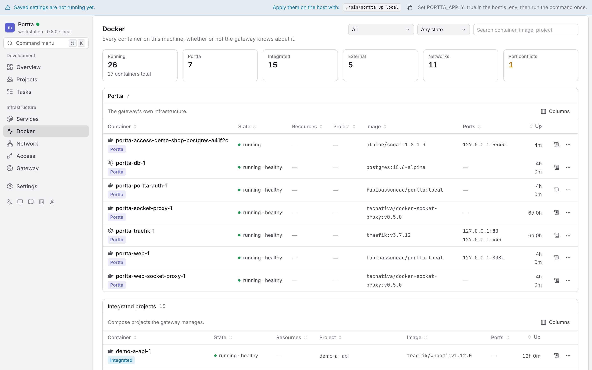

Below the sections, a host summary: engine and resources, container counts by
section, networks, and every published port with the container holding it.
Ports claimed by two containers are flagged, which is usually the answer to
"why will this not start".


Filters: All / Portta / Integrated / External / Standalone, crossed with
Any state / Running / Stopped / Unhealthy, plus a search over container name,
image, project, service and hostname.

### Network

Domains (local, VPN, public), TLS mode and ACME contact, Tailscale state, the
DNS provider, every routed hostname with its target port, and the Docker
networks with their role: shared, control, access, or a project's own.

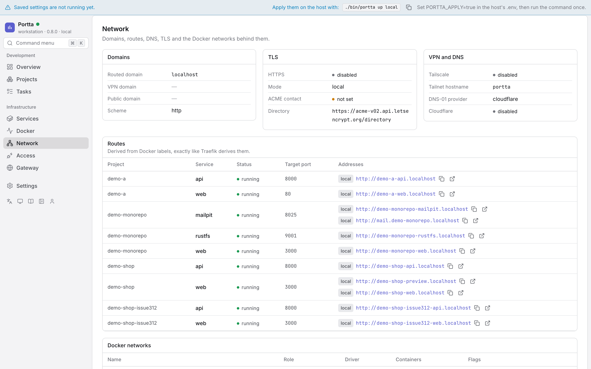

### Access

Databases, caches and anything else that speaks TCP rather than HTTP.

```text
PostgreSQL    base-empresarial/postgres     [ Open local access ]
```

and afterwards:

```text
127.0.0.1:55431      copy host   copy port   copy connection string   close
```

The bridge is the same one [`portta access open`](tcp-access.md) creates,
with byte-identical labels, so `portta access list`, `close` and `gc`
manage it too and neither tool is surprised by the other's work. It binds
`127.0.0.1` on a port the kernel picks, so any number of databases can be
reachable at once without one of them having to give up 5432.

The connection string is a template. It never contains a password: the gateway
does not read a project's `.env` to be helpful.

The **Gateway address** column is the other way in, when
[hostname routing](tcp-routing.md) is enabled: a stable
`<project>-<service>.<domain>:<port>` that needs no bridge at all. Where a
protocol cannot do it the column says so rather than leaving a blank, and where
a project has not opted in it says that too.

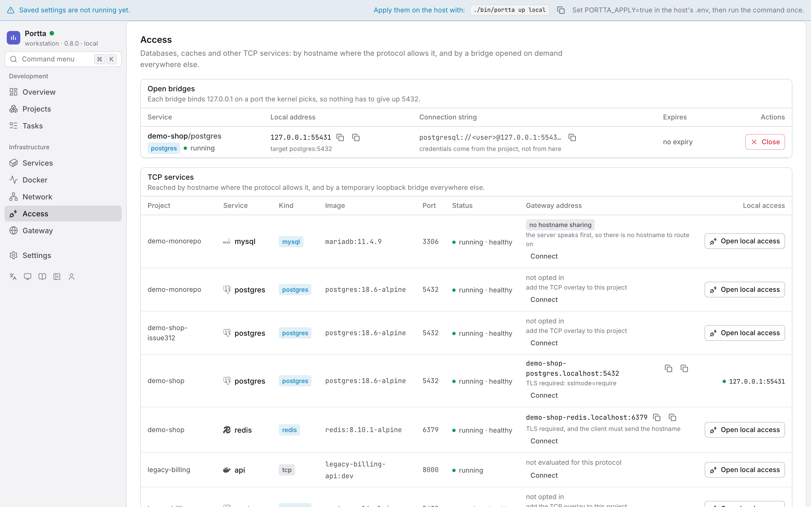

This page also lists persistent forwarders created with
[`portta service publish --private`](tailscale-services.md).

### Gateway

Component states, versions, the profile, diagnostics, and logs for Traefik, the
socket proxy and Tailscale.

**Diagnostics are not `portta doctor`.** They are the checks a container
can make honestly: components present and healthy, the shared network, services
that opted into Traefik but never joined it, hostname collisions, port
conflicts, stale bridges, unhealthy containers, and configuration that would
refuse to start. `doctor` runs on the host and additionally sees `PATH`,
listening sockets, DNS resolution and certificate files, which this process
cannot see truthfully. The panel says so and points at the command.

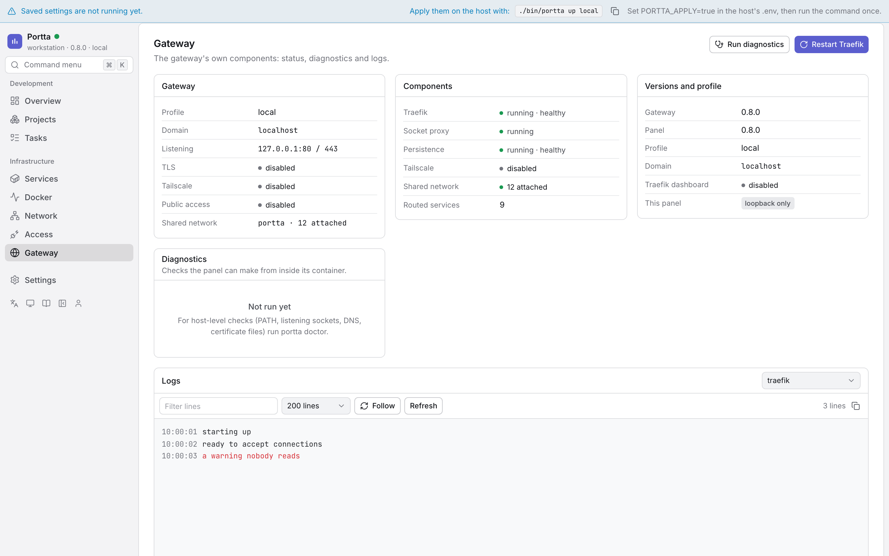

### Settings

Settings is a place with six sections, and which of them somebody sees depends
on what they hold. The rail lists only the ones they can open; `/settings`
itself redirects to the first of them, so an owner lands on General and a viewer
lands on their own tokens. A panel in `open` mode has no accounts, so Users,
API tokens, Security and Audit are not offered at all — and a bookmark into one
of them says the panel is local rather than showing an empty table.

| Section | What it is | Who has it |
|---|---|---|
| General | How Portta names projects, who can reach them, and how this panel is reached | `settings:read` |
| Users | Accounts, roles, Project access, ownership | `user:list` |
| API tokens | The credentials that are not a browser | `token:read` |
| Security | Your own password, second factor and sessions | anybody signed in |
| Integrations | GitHub: the connection and its keys | `github:read` |
| Audit | Who did what, newest first | `audit:read` |

**General** is the settings people actually change. The groups follow three
decisions that stay independent: how projects are named, who can reach Traefik,
and how this panel is reached. The conceptual map is
[addresses-and-access.md](addresses-and-access.md). Each group has a stable
deep link, such as `/settings/general/tls` or
`/settings/general/project-access`. Moving between groups keeps one shared
draft; badges identify unsaved work in another group and Save writes every
changed key in one transaction. A key that is not in the catalogue cannot be
read or written through the API, whatever a request asks for.

Gateway, public access and VPN are one **Project access** group. The form writes
their existing environment keys together so an operator cannot select a public
profile while leaving the public access decision or bind address behind.

The Traefik group shows the dashboard's status, every address that applies,
and an Open action that is enabled only when an endpoint is usable. The
dashboard stays on loopback under the normal host attachment: it has no login
of its own. The panel warns when a Tailscale attachment also exposes it on the
tailnet. Changing
`PORTTA_DASHBOARD` needs the gateway recreated; the apply bar at the bottom
is how that happens.

The Panel group also carries **what a local agent may do**: the
`agentPermissions` setting, ticked one permission at a time, with the default
in force until somebody narrows it. It is a ceiling over a request that
announces itself with `X-Portta-Actor` — it can only take away from what the
person behind it holds, never add.

**Users** lists who can sign in with their role, whether the account is usable,
and the Projects it reaches. Creating one hands over the first password on the
spot: this panel sends no email. The row menu carries the role, a password
reset, Project access, the open sessions, the ban and the removal — each of
them absent rather than disabled when the rule behind it would refuse
([Authentication](authentication.md#the-rules-a-role-cannot-express)). Removing
asks for the email to be typed. Transferring ownership is offered to the owner
alone, and never on their own row.

**API tokens** shows yours by default; an administrator can switch to
everybody's. A new token's secret appears once, in a dialog that does not close
on an escape key: the panel keeps a hash, so a lost secret means making another
token. Revoking says what stops working before it does it.

**Security** is your own account. Changing your password signs you out of every
other browser. Turning on a second factor asks for your password, shows the QR
code (and the secret, for an app that cannot scan it), verifies one code from
the app, and then shows the backup codes once. The session list marks the
browser you are reading it in and signs the others out one at a time.

**Audit** is who did what: accounts, roles, tokens, Project membership,
settings, and every lifecycle operation on an environment or a container.
Newest first, filtered by account, paged backwards. Development activity —
tasks, work sessions, commits — is not in it and lives on the Activity page
instead, and nothing that authenticates anything is in it either
([security](security.md#the-audit-log)).

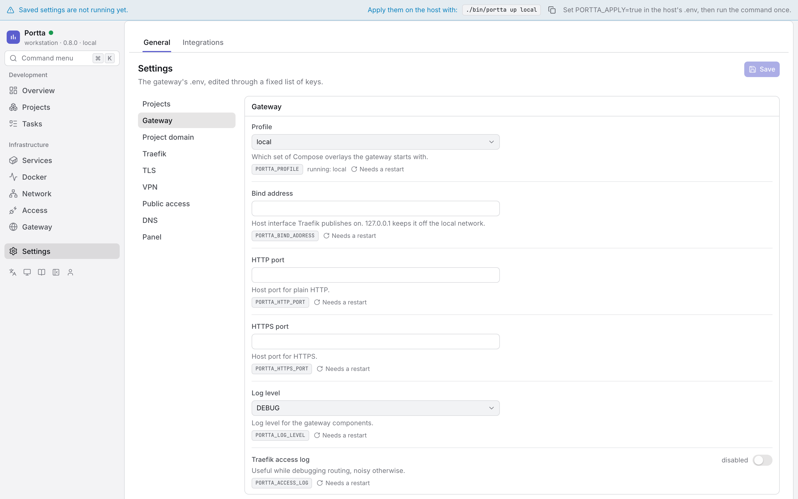

### Live updates

Two channels, and they carry different things.

**The event stream** (`GET /api/events`, server-sent events) is what keeps the
pages current: a container changed state, a task moved, a repository was
scanned. It needs `activity:read`, and every event is filtered against the
principal it belongs to — an event about a Project somebody does not reach is
not delivered late or redacted, it is not delivered. Events with no Project in
them at all (a settings change, a gateway restart) go only to the people who
see everything. The browser reconnects on its own; the panel sends a keepalive
every twenty seconds so a proxy does not close a quiet stream.

**The log stream** (`/ws/environments/:name/logs`) is a WebSocket, because
following a log is a stream and polling for it was three requests for the same
lines every three seconds. Pressing **Follow** opens one connection and the
lines arrive as Docker emits them. It reconnects with a widening delay, says so
while it is trying, and falls back to the polling it replaced when it cannot
stay up.

The handshake is authorised before it becomes a socket: `logs:read`, scoped to
whichever Project adopted the environment. A refusal is an HTTP status —
`401` with no credential, `403` without the permission or the Project, `404`
for a path or an environment that is not there — and the socket is closed
rather than left open. One listener handles every `/ws/…` path, so a path no
route claims is refused there rather than falling through to Next.

### Light and dark

The theme is light, dark or system, chosen from the theme control at the foot
of the sidebar or from the command menu. Only an explicit choice is stored, so
a panel that was never told keeps following the operating system. The same
Overview, in the dark theme:

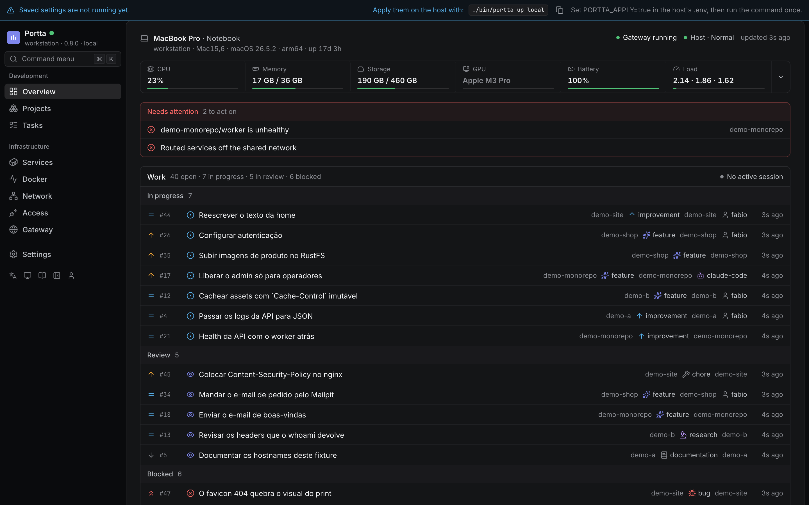

---

## Actions

| Target | Available |
|---|---|
| Integrated service | logs, start, stop, restart, details, remove (with confirmation) |
| External container | logs, start, stop, restart, details, remove (with confirmation) |
| Project | restart its running services, open its URLs, see its services |
| TCP service | open a loopback bridge, close it, copy host / port / connection string |
| Gateway | status, diagnostics, logs, restart components, apply saved settings (opt-in) |

Never offered: recreating **somebody else's** Compose project, editing
configuration or environment variables of a container, changing its networks or
volumes, running an arbitrary command, `docker compose down -v`, resetting a
database, mass removal, or any kind of prune.

The one exception is the gateway's own project, and only through the opt-in
applier described below ([ADR 0026](adr/0026-applying-settings-from-the-panel.md)):
a container the host prepares, whose command is fixed at creation and which the
panel can only start.

### Removing a container

The only destructive action, and it always asks first. The confirmation names
the container and its image, says whether it belongs to the gateway or is
external, and lists its named volumes and bind mounts.

What a removal does **not** do:

- it does not remove a volume, named or anonymous (the call is always
  `v=0&link=0`);
- it does not remove a network;
- it does not remove an image;
- it does not touch a sibling in the same Compose project;
- it never runs a prune.

Gateway components cannot be removed from the panel at all. Access bridges are
closed from the Access page, which removes them cleanly.

### Restarting the gateway

`Restart Traefik` restarts the container in place. Traefik reads its static
configuration from the environment it was created with
([ADR 0003](adr/0003-traefik-static-config-via-env.md)), so a settings change
needs the containers **recreated**, not restarted. The panel says this rather
than pretending a restart was enough: saved settings the running gateway has not
picked up are marked `pending restart`, and a bar at the top of every page says
so wherever you are.

By default, applying them is a command on the host:

```bash
./bin/portta up local
```

### Applying settings from the panel

With `PORTTA_APPLY=true` in `.env`, `portta up` also prepares a stopped
container whose command is fixed at creation — `portta up`, with no argument the
panel can influence — and the pending bar gains an **Apply and restart** button
that starts it.

The confirmation names the pending keys, and says plainly that this panel is one
of the containers being recreated. It then shows a dialog with a stopwatch while
the panel goes offline and comes back, and reports the applier's exit code and
output if it failed. If a pending setting moves the panel's own address, the
confirmation says the tab will not reconnect on its own.

On a repository checkout the apply rebuilds the local images first, which takes
minutes rather than seconds on a cold cache. The confirmation says so, and the
panel waits longer before declaring a timeout. If there is no applier at all,
the bar names which of the three reasons applies — the key is off, this host
refuses, or `portta up` has not prepared one yet — rather than guessing.

Turning this on is a host decision, deliberately: the key is not in the panel's
field catalogue, so the panel cannot enable itself. Be clear about what it
grants — anyone who can write through the panel can then run `portta up` on the
host. It is refused in read-only mode, refused when the panel is exposed
publicly, and refused on the `remote-public` profile. See
[ADR 0026](adr/0026-applying-settings-from-the-panel.md) for the full account,
including what can still go wrong.

---

## Configuration

All of these live in `.env`; `portta web up` sets the first ones for you.

| Key | Default | Meaning |
|---|---|---|
| `PORTTA_WEB` | `false` | Whether the panel starts with the gateway |
| `PORTTA_WEB_BIND_ADDRESS` | `127.0.0.1` | Interface the panel is published on |
| `PORTTA_WEB_PORT` | `8081` | Host port |
| `PORTTA_WEB_EXPOSE` | `local` | `local`, or `vpn` to add a Traefik router |
| `PORTTA_WEB_HOST` | `portta-web` | Hostname label used by `--expose vpn` |
| `PORTTA_WEB_READ_ONLY` | `false` | Refuse every mutating endpoint |
| `PORTTA_WEB_DEV` | `false` | Development mode: HMR on the same port the API answers on |
| `PORTTA_WEB_NETWORK` | `portta-web` | The panel's internal control network |
| `PORTTA_WEB_USER` | `node` | User the container runs as, see below |

`.env` is owner-only, so the container has to run as whoever owns it. The
installer records this, and `bootstrap` and `web up` now record it too when the
key is absent:

```bash
PORTTA_WEB_USER=1000:1000     # $(id -u):$(id -g)
```

The image's own `node` is a last resort, and is right only when the host uid
happens to be 1000 — on macOS it is usually 501, so the default was wrong there
as well, not only on Linux. The panel reports whether the file is writable and
says to edit it on the host when it is not.

In development mode the container keeps running as `node` on purpose: it writes
no host file, and it does write inside the image, where only `node` has
permission.

---

## Security

The panel is the one component that can start, stop and remove containers, so
what it cannot do matters more than what it can.

**Network.** Loopback by default. VPN routing, the dedicated public panel
entrypoint and routing on the gateway's own domain are separate, explicit
overlays and all three are refused without a credential. Public panel exposure
does not publish the application's `web`/`websecure` entrypoints.

`PORTTA_WEB_EXPOSE=domain` routes the panel at one hostname of the gateway's
domain, on `websecure`, so it gets the certificate that entrypoint already
terminates instead of the plain HTTP the `panel` entrypoint serves. It requires
TLS and a credential, publishes no host port, and names exactly one host — an
application is still reachable only through a router of its own. What it gives
up, and why, is written down in
[ADR 0021](adr/0021-panel-access-modes.md#amendment-2026-09-02-domain-and-what-it-costs).

**Authentication.** Traefik calls the separate `portta-auth` process before
forwarding a protected request. The password is generated, shown once and
stored only as scrypt in `state/auth/protections.json`; the auth process mounts
that file read-only and has no Docker socket or database. A middleware Traefik
cannot resolve makes the router fail closed. `doctor` and the panel's own
diagnostics fail, not warn, when the secret, store or auth service is missing or
unsafe. See [Authentication](authentication.md).

**Traefik configuration.** The panel mounts `config/traefik/dynamic/`
read-write and may write exactly four filenames in it,
`portta-panel.yaml`, `portta-shares.yaml`, `portta-aliases.yaml` and
`portta-auth.yaml`. Any other path is refused in its own process,
before the write. Everything else in that directory
is yours. See [ADR 0011](adr/0011-panel-reads-traefik-writes-one-file.md).

**Docker.** Its socket proxy grants the read endpoints plus the container
lifecycle, and denies images, volumes, exec, build, swarm, secrets, plugins and
the system endpoints. On top of that the panel refuses to emit any request that
is not on its own allowlist, so `prune`, `exec`, `archive` and `attach` are
denied even where the proxy would forward them. See
[ADR 0008](adr/0008-web-panel-socket-proxy.md).

**Container creation.** One shape only: the socat TCP bridge, with a fixed
image, fixed labels, no binds, no mounts, no capabilities and no privileged
mode. There is no generic create endpoint.

**Secrets.** `TS_AUTHKEY` and `CF_DNS_API_TOKEN` are never returned by the API,
in whole or in part. The panel reports only whether they are set. Sending an
empty string leaves a secret unchanged; clearing one is explicit. `.env` is
written through a temporary file with mode `600`.

**Writes from another site.** A page on another origin can point a request at
`127.0.0.1`. Reads behind loopback are harmless enough; writes are not, so a
mutating request must come from the panel's own origin (or `localhost`).

**Input.** Every request body is validated with a schema before anything acts
on it. Container ids are checked against Docker's own shape. No shell command
is ever built from a value the UI supplied, because the panel runs no shell
commands at all.

`tests/unit/web.test.sh` asserts each of these as an invariant, so loosening one
fails the build. The wider threat model is in [security.md](security.md).

---

## Troubleshooting

**The panel does not come up.**

```bash
./bin/portta web status
./bin/portta web logs
```

**"cannot reach the Docker socket proxy".** The panel's proxy is not running or
not healthy:

```bash
./bin/portta web logs web-socket-proxy
./bin/portta web restart
```

**Everything is empty, and the Overview says the Docker API is unreachable.**
The proxy is up but denying calls. Confirm the panel is talking to its own
proxy (`PORTTA_RUNTIME_DOCKER_API`), not Traefik's read-only one, which denies every
write.

**"Open local access" says the bridge image is not on this host.** The panel
cannot pull images, deliberately. Pull it once on the host:

```bash
docker pull alpine/socat:1.8.1.3
```

`portta web up` does this for you; this happens when the panel was started
some other way.

**Settings will not save.** The panel reports the file as not writable. On
Linux, set `PORTTA_WEB_USER` as above, or edit `.env` on the host.

**A saved setting has no effect.** Traefik reads its static configuration at
startup. Run `./bin/portta up <profile>` on the host; the panel shows the
exact command.

**The live indicator says `offline`.** The event stream dropped. The panel
reconnects on its own, with backoff; a reload also does it. Everything else
keeps working, it just stops updating by itself.

**Port 8081 is taken.** `./bin/portta web up --port 8099`. The Docker page
shows which container is holding it.

**A container I removed came back.** It belonged to a Compose project, and
something ran `docker compose up` in that project's directory. The panel warns
about this in the confirmation.

---

## Out of scope

Not implemented, and not planned for this version: users, roles and RBAC (the
panel has one credential, held by Traefik), historical metrics, monitoring,
Kubernetes, deployments, a Compose editor, a web terminal, image management,
volume management, network management, arbitrary container creation, arbitrary
Traefik configuration, an embedded Traefik dashboard, a tunnel service, or
being a replacement for Portainer or Docker Desktop.

Tasks, the board, sessions, activity and the GitHub binding **shipped**;
[github.md](github.md) and [mcp.md](mcp.md) describe them. What remains out
of scope there: GitHub comments are never projected (reading one is a link to
GitHub), GitHub Projects v2 fields are not read, and a web editor or a file
browser beyond the instruction files is a later step. Local Git stays
host-collected ([ADR 0010](adr/0010-git-collected-on-the-host.md), amended by
[ADR 0032](adr/0032-portta-development-model.md)).

Sharing is deliberately narrow: one additional hostname per service, with an
expiry, on a network the gateway already answers. It is not authentication for
a project and never becomes an identity layer.

The panel exists to make the gateway pleasant to use day to day, for people and
for agents, and to stop there.
